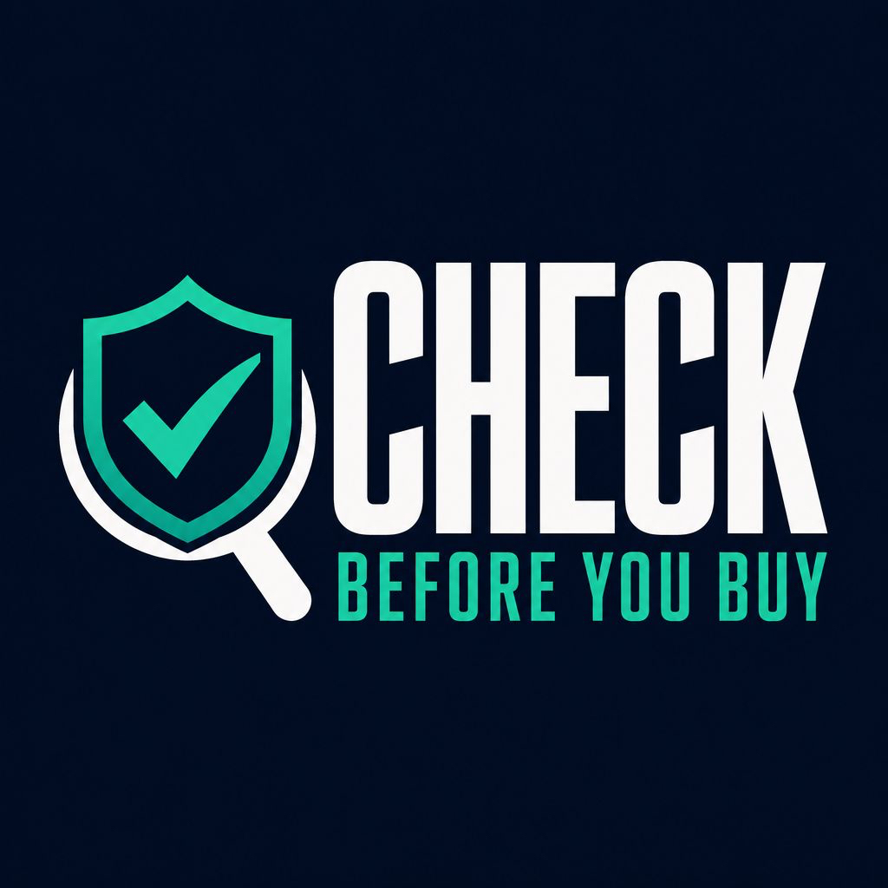
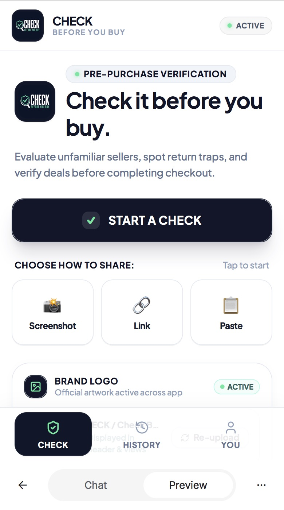
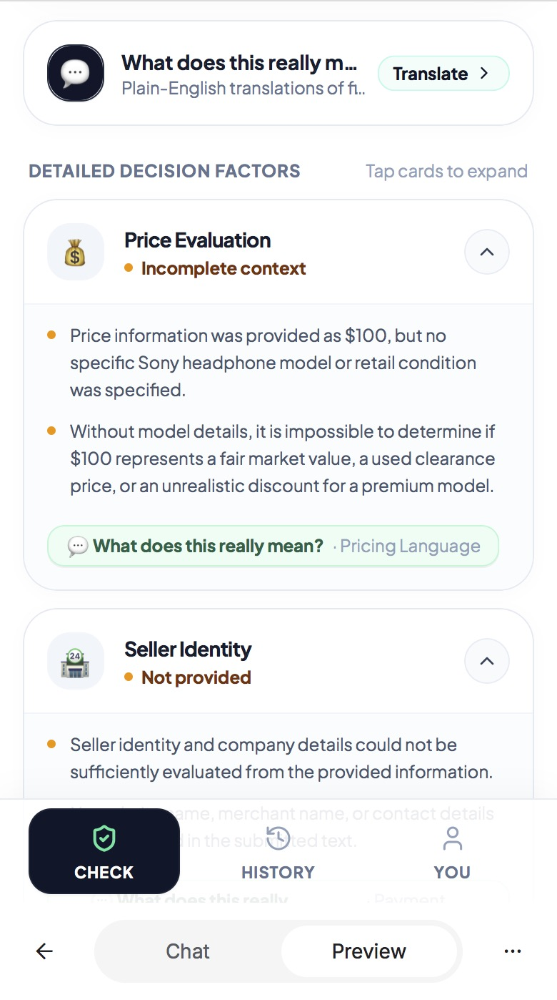
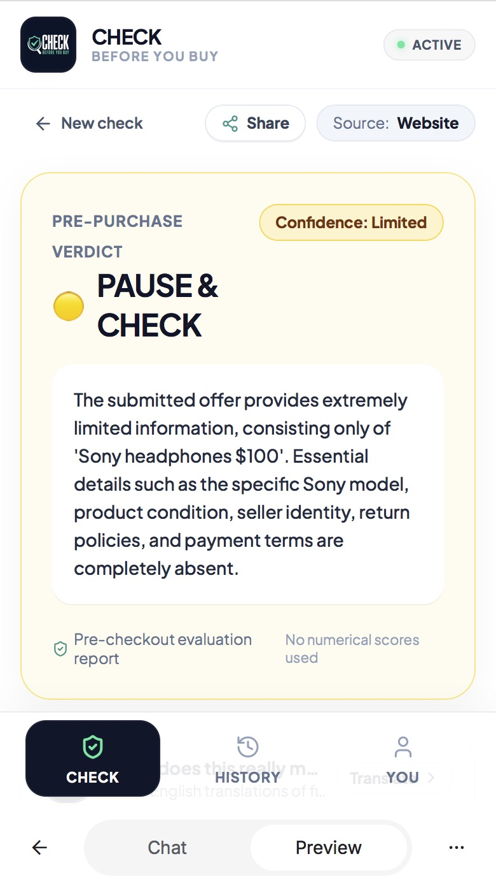
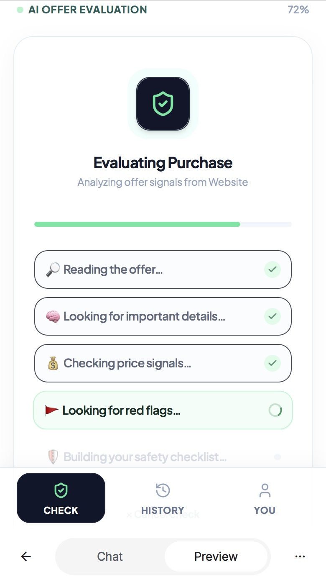
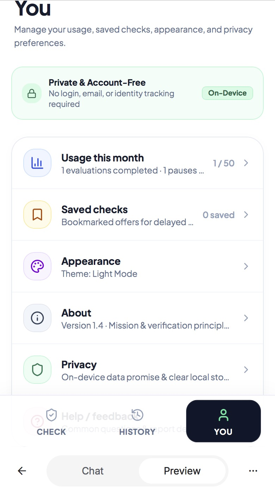

# CHECK — Before You Buy

### Know what you're buying before you pay.

Evaluate unfamiliar sellers, spot return traps, and verify deals before completing checkout.

 

<a href="https://check-before-you-buy.vercel.app">
  <strong>🚀 OPEN CHECK — LIVE APP</strong>
</a>

---

## 🛡️ What is CHECK?

**CHECK** is an AI-powered purchase safety assistant designed to help you evaluate online offers before completing a purchase.

Instead of rushing through a listing or seller's description, CHECK helps you examine the information you already have and identify things worth looking into before you pay.

---

## 🔍 How It Works

### 1. Share the listing

Choose the way that's easiest for you:

- 📸 **Screenshot** — Share a screenshot of the listing or offer
- 🔗 **Link** — Submit the listing URL
- 📋 **Paste** — Paste the listing or seller information

### 2. Let CHECK analyze it

CHECK reviews the information you provide and helps surface important things to understand before purchasing.

### 3. Get practical next steps

Your results include:

- **What does this really mean?**
- **What should I do before paying?**
- **ASK THE SELLER**

---

## ✨ Features

| Feature | What it does |
|---|---|
| 📸 Screenshot | Submit listing information from a screenshot |
| 🔗 Link | Submit a product or listing URL |
| 📋 Paste | Paste listing or seller information |
| 🤖 AI Analysis | Analyze submitted purchase information |
| 💬 ASK THE SELLER | Get useful questions to ask before buying |
| 🕘 HISTORY | Save and revisit previous checks |
| 👤 YOU | Access your personal app area |

---

## 📱 Explore CHECK

 

---

## 💡 Why CHECK?

Online purchases can involve unfamiliar sellers, confusing listings, unclear return policies, and claims that deserve a closer look.

CHECK gives shoppers a simple place to pause, examine the information they have, and identify questions worth answering before they pay.

> **Check first. Buy second.**
---

## 📱 Built for Real Purchase Decisions

CHECK is designed around a simple idea:

> **Check first. Buy second.**

Whether you're considering an unfamiliar seller, a marketplace listing, or a deal that seems worth investigating, CHECK gives you a place to pause and verify the details before completing checkout.

---

## 🚀 Try CHECK

<a href="https://check-before-you-buy.vercel.app">
  <strong>→ Open CHECK — Before You Buy</strong>
</a>

---

## 🛠️ Built With

- React
- TypeScript
- Vite
- AI-powered analysis
- Responsive mobile-first interface
- Vercel

---

## CHECK BEFORE YOU BUY

**Verify. Understand. Then decide.**

 

<a href="https://check-before-you-buy.vercel.app">
  🚀 <strong>OPEN THE LIVE APP</strong>
</a>

